# 🔒 LetsLockIn

<div align="center">
  
  <h3>AI-Powered Focus & Posture Assistant</h3>
  
  
  
  
  
  
</div>

## 🌟 Overview

Welcome to **LetsLockIn**, the ultimate productivity and wellness application that integrates **real-time focus monitoring** with **AI-powered insights**. Designed for the modern workplace, it promotes healthier work habits and maximizes productivity by offering **non-intrusive monitoring**, privacy-focused design, and actionable feedback.

### 🚀 Visit Our Website  
For more information, explore our official website:  
[**letslockin.dev**](https://www.letslockin.dev)

Our mission is to create a **healthier and more productive work environment** by leveraging advanced AI models to **monitor focus, posture, and fatigue** in real time—all while respecting user privacy.

## 🎯 Features

### 🧘‍♂️ **Health Benefits**
- Encourages better posture to prevent back and neck strain
- Monitors and alerts signs of fatigue
- Promotes healthier work-rest balance

### ⚡ **Productivity Improvements**
- Tracks real-time focus and productivity trends
- Prevents burnout through early detection of **overworking**
- Increases concentration with actionable feedback

### 🖥️ **User Experience**
- Clean, modern interface for seamless interaction
- Cross-device compatibility with responsive design
- Intuitive and interactive visualization of productivity metrics

### 🔒 **Privacy-Focused**
- All processing happens locally on your device
- No sensitive data leaves your browser, ensuring privacy

## 📈 Technical Specifications

### **Core AI Model**
- **Framework**: TensorFlow 2.15.0, tensorflow-decision-forests 1.8.0
  > ⚠️ **Important**: TensorFlow.js conversion is only supported for models trained with TensorFlow 2.15.0 or lower (I trained the model using Tensorflow 2.15.0). Newer versions such as 2.17.0 are **not compatible** for deployment.
- **Architecture**: ResNet-based deep neural network
- **Dataset Details**:
  - **Training**: AffectNet, RAF-DB, CK+  
  - **Verification**: Filtered subsets of the same datasets  

### **Training Details**
- **Challenges Addressed**:
  - Overfitting mitigated using dropout and data augmentation.
  - Gradient vanishing and exploding resolved with residual connections.
  - Optimized for real-time web deployment by reducing model size and complexity.
### **Directory Structure**⚠️🔑✅
- **v2_afrafck_model**:
    - Short for version 2_affectnet_Raf-DB_CK+_model
    - Includes:
         - **Training ipynb and validating ipynb files**
         - accuracy reports,
         - normalized accuracy reports,
         - confusion matrices,
         - normalized confusion matrices,
         - Paramerters report, log, final .h5 model,
         - final model architecture (json)
    - **IMPORTANT FILES (SHOULD READ)**:
    
         ```bash
         letslockin_train.ipynb
 
         confusion_matrix.ipynb
    
         Norm_RAF_DB_accuracy_report.txt
         (normalized RAF-DB validation accuracy report)

         Norm_RAF_DB_confusion_matrix.png

         model_performance.png
         ```
- **tf2js_model**:
    - Short for Tensorflow to JS model
    - Includes:
         - .Bin file
         - .Json file
- **HTML, CSS, SCRIPT**
      

## 🛠️ Technical Deep Dive

### Neural Network Architecture

Our Complex Residual Network consists of 41 carefully designed layers:

```mermaid
flowchart TD
    input1[Input Layer 160x160x1] --> conv2d[Conv2D 32]
    conv2d --> bn1[BatchNorm]
    bn1 --> act1[ReLU]
    act1 --> maxpool[MaxPool2D]
    maxpool --> drop1[Dropout 0.5]

    %% First Block
    drop1 --> conv2d_1[Conv2D_1 64]
    drop1 --> conv2d_3[Conv2D_3 64]
    conv2d_1 --> bn2[BatchNorm_1]
    bn2 --> act2[ReLU_1]
    act2 --> conv2d_2[Conv2D_2 64]
    conv2d_2 --> bn3[BatchNorm_2]
    conv2d_3 --> bn4[BatchNorm_3]
    bn3 & bn4 --> add1[Add_1]
    add1 --> act3[ReLU_2]
    act3 --> drop2[Dropout 0.5]

    %% Second Block
    drop2 --> conv2d_4[Conv2D_4 128]
    drop2 --> conv2d_6[Conv2D_6 128]
    conv2d_4 --> bn5[BatchNorm_4]
    bn5 --> act4[ReLU_3]
    act4 --> conv2d_5[Conv2D_5 128]
    conv2d_5 --> bn6[BatchNorm_5]
    conv2d_6 --> bn7[BatchNorm_6]
    bn6 & bn7 --> add2[Add_2]
    add2 --> act5[ReLU_4]
    act5 --> drop3[Dropout 0.5]

    %% Third Block
    drop3 --> conv2d_7[Conv2D_7 128]
    drop3 --> conv2d_9[Conv2D_9 128]
    conv2d_7 --> bn8[BatchNorm_7]
    bn8 --> act6[ReLU_5]
    act6 --> conv2d_8[Conv2D_8 128]
    conv2d_8 --> bn9[BatchNorm_8]
    conv2d_9 --> bn10[BatchNorm_9]
    bn9 & bn10 --> add3[Add_3]
    add3 --> act7[ReLU_6]
    act7 --> drop4[Dropout 0.5]

    %% Final Layers
    drop4 --> globalpool[Global AvgPool2D]
    globalpool --> dense1[Dense 3072]
    dense1 --> act8[ReLU_7]
    act8 --> drop5[Dropout 0.5]
    drop5 --> dense2[Dense 7 classes]
    dense2 --> output[Output Softmax 7 classes]

    %% Modern Color Styling
    classDef input fill:#4A90E2,stroke:#333,stroke-width:2px,color:white
    classDef conv fill:#2C3E50,stroke:#333,stroke-width:2px,color:white
    classDef bn fill:#E74C3C,stroke:#333,stroke-width:2px,color:white
    classDef act fill:#3498DB,stroke:#333,stroke-width:2px,color:white
    classDef pool fill:#F39C12,stroke:#333,stroke-width:2px,color:white
    classDef drop fill:#1ABC9C,stroke:#333,stroke-width:2px,color:white
    classDef add fill:#9B59B6,stroke:#333,stroke-width:2px,color:white
    classDef dense fill:#E67E22,stroke:#333,stroke-width:2px,color:white
    classDef output fill:#16A085,stroke:#333,stroke-width:2px,color:white

    class input1 input
    class conv2d,conv2d_1,conv2d_2,conv2d_3,conv2d_4,conv2d_5,conv2d_6,conv2d_7,conv2d_8,conv2d_9 conv
    class bn1,bn2,bn3,bn4,bn5,bn6,bn7,bn8,bn9,bn10 bn
    class act1,act2,act3,act4,act5,act6,act7,act8 act
    class maxpool,globalpool pool
    class drop1,drop2,drop3,drop4,drop5 drop
    class add1,add2,add3 add
    class dense1,dense2 dense
    class output output
```



### Performance Metrics
- **Validation Accuracy**: 72.852%
- **Real-time Processing**: 30 FPS, 8 FPS when using other tabs or when the browser is minimized (to save battery life)
- **Browser Compatibility**: 98%, (Safari is very strict in allowing js to run in the background so even though I set the FPS to 8 FPS, it may drop under 5 FPS. For other browsers, it works decently without significant battery impact)
  

## 💻 Quick Start

```bash
# Clone the repository
git clone https://github.com/letslockin/letslockin.git

# Navigate to project directory
cd letslockin

# Start local server (Python 3)
python -m http.server 8000

# Visit in browser
open http://localhost:8000
```

> ⚠️ **Important Note**: This model must be trained with TensorFlow 2.15.0 as TensorFlow.js conversion is not compatible with TensorFlow 2.17.0


## 📊 Results & Achievements

- **High Accuracy Emotion Recognition**
  - 72.852% accuracy achieved using our 41-layer ResNet architecture
  - Validated across multiple datasets
- **Extensive Training Data**
  - 297,074 filtered training images
  - 6,568 validation images
- **Real-time Performance**
  - 30 FPS processing rate, 8 FPS background processing rate (could be higher up to 50 FPS but I set 8 FPS to maximize battery life)
  - 98% browser compatibility

## 👤 Author

<div align="center">
  <table>
    <tr>
      <td align="center">
        <br/>
        <b>Bach Pham</b><br/>
        AI Engineer<br/>
        <a href="https://github.com/2006coder">@2006coder</a>
      </td>
    </tr>
  </table>
</div>

## ⚠️ Disclaimer

This application is designed to assist with focus and posture improvement. It is not a medical device and should not be used as a substitute for professional medical advice.

## 📄 License

Copyright © 2024 **LetsLockIn**. All rights reserved.

---

<div align="center">
  <h3>🌟 Star us on GitHub</h3>
  <p>Support our mission to revolutionize productivity and well-being!</p>
  <a href="https://github.com/2006coder/letslockin">
    
  </a>
</div>

<div align="center">
  Made with ❤️ by Bach
</div>
